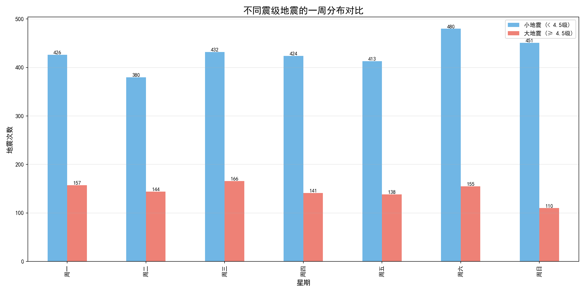

# 🌍 地震数据统计器

基于 Python 和 USGS API 的地震数据获取、分析和可视化平台


---

## 📊 项目简介

本项目从美国地质调查局（USGS）获取真实地震数据，进行统计分析，并生成交互式可视化地图，帮助直观了解全球地震分布规律。

**核心发现**：通过 365 天（29,801 条）地震数据的分析验证，发现"周六地震最多"的现象是**观测偏差**——周末人类活动减少，地震仪更容易捕捉到小地震，而非地球本身更活跃。

---

## 🎯 功能列表

| 功能 | 说明 |
|------|------|
| 📡 数据获取 | 从 USGS API 实时获取地震数据 |
| 📊 统计分析 | 震级、深度、时间维度的统计分析 |
| 📈 可视化图表 | 震级分布、深度分布、时间分布等 |
| 🗺️ 交互式地图 | 在地图上标记地震位置，点击查看详情 |
| 🔍 数据筛选 | 按震级、日期、地区筛选数据 |
| 📥 数据导出 | 一键下载筛选后的数据 |
| 🔬 关键发现 | 展示"周六效应"的完整验证过程 |

---

## 🛠️ 技术栈

| 技术 | 用途 |
|------|------|
| Python 3.10 | 编程语言 |
| Streamlit | Web 应用框架 |
| Pandas | 数据处理 |
| Matplotlib + Seaborn | 数据可视化 |
| Folium | 交互式地图 |
| Requests | API 数据获取 |
| Git + GitHub | 版本控制 |

---

## 📁 项目结构

```text
EARTHQUAKE_PROJECT/
├── app.py                    # Streamlit 网页应用
├── requirements.txt          # Python 依赖列表
├── README.md                 # 项目说明
├── .gitignore                # Git 忽略文件
│
├── data/                     # 数据目录
│   └── earthquakes_raw.csv   # 原始地震数据
│
├── scripts/                  # Python 脚本
│   ├── get_data.py           # 数据获取
│   ├── analyze_data.py       # 数据分析与可视化
│   ├── query_earthquakes.py  # 地震查询与地图
│   ├── time_analysis.py      # 时间维度分析
│   └── layer_analysis.py     # 震级分层验证
│
├── output/                   # 输出目录
│   └── images/               # 统计图表
│
└── tools/                    # 工具脚本
    └── organize_project.py   # 项目文件整理工具
```

---

## 🚀 快速开始

### 1. 克隆项目

```bash
git clone https://github.com/lishilin0130-del/earthquake_project.git
cd earthquake_project
```

### 2. 创建虚拟环境

```bash
conda create -n earthquake python=3.10
conda activate earthquake
```

### 3. 安装依赖

```bash
pip install -r requirements.txt
```

### 4. 获取数据

```bash
cd scripts
python get_data.py
```

### 5. 启动 Web 应用

```bash
streamlit run app.py
```

浏览器会自动打开 `http://localhost:8501`

---

## 📊 关键发现：周六效应是"观测偏差"

基于 2025-6-21到2026-6-21 **365天（29,801条）** 地震数据的分析验证。

### 📅 发现一：周六地震最多

| 排名 | 星期 | 地震次数 |
|------|------|----------|
| 1 | 周六 | 635 次 |
| 2 | 周五 | 561 次 |
| 3 | 周三 | 552 次 |
| 4 | 周日 | 548 次 |
| 5 | 周一 | 539 次 |
| 6 | 周四 | 531 次 |
| 7 | 周二 | 524 次 |

### 🧐 发现二：分层验证

| | 小地震 (< 4.5级) | 大地震 (≥ 4.5级) |
|---|---|---|
| 地震最多的星期 | 周六 (480次) | 周三 (166次) |
| 地震最少的星期 | 周二 (394次) | 周二 (130次) |

**关键结论**：如果"周六效应"是真实的地球物理规律，大地震也应该在周六最多。但事实是大地震最多的是周三，说明"周六效应"是**人为活动噪声造成的"观测偏差"**，而非真实的物理规律。

### 💡 科学解释

| 时间 | 人类活动 | 对地震观测的影响 |
|------|---------|-----------------|
| 工作日 | 交通、工厂、采矿产生大量振动 | 背景噪声高，掩盖小地震信号 |
| 周末 | 人为噪声减少 | 地震仪能更完整地记录小地震 |

> 因此，周六地震多不是因为地球更活跃，而是因为人类休息了，地震仪听得更清楚了。

---

## 📈 效果展示

### 震级分布图


### 一周分布对比图



### 地震位置地图

交互式地图上，不同颜色的圆点代表不同震级的地震：

- 🔴 红色：≥ 6.0 级
- 🟠 橙色：5.0 - 5.9 级
- 🟡 黄色：4.0 - 4.9 级
- 🟢 绿色：2.5 - 3.9 级

---

## 📈 数据来源

数据来源于 [USGS 地震目录 API](https://earthquake.usgs.gov/fdsnws/event/1/query)

---

## 👤 作者

- **Shilin Li** (lishilin0130-del)
- 完成时间：2026年6月21日

---

## 📝 许可证

MIT License

---

## 🙏 致谢

- 美国地质调查局（USGS）提供公开地震数据
- Streamlit 提供优秀的 Web 应用框架
```